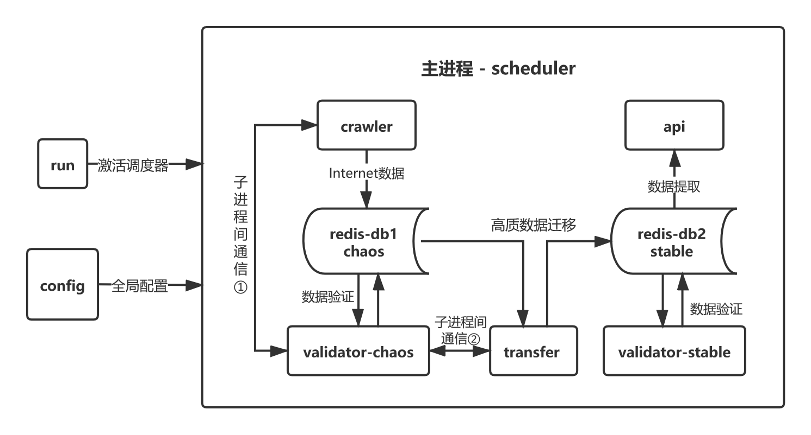

# ProxyPool
一个高可用、易部署、长稳定、易扩展的**IP代理池**。


## 特点

- 高可用：改变常规代理池仅对单个数据库进行数据处理的设计，建立两个数据池—— chaos + stable，分别用于数据的原始清理和提供稳定IP代理调用接口，提高鲁棒性，从而有效避免了因新未知数据进入到数据库，导致IP代理质量下降，网页请求失败的可能性
- 易部署：采用Docker的容器化部署，快速搭建服务，降低了代理池使用的学习成本
- 长稳定：自由制定分级评分机制，在 config 文件中分别对混沌池、稳定池的初始分、最低允许分、最高可控分，以及迁移条件进行设定，从而在保证代理质量的同时有效控制计算资源占用
- 易扩展：针对互联网公开代理资源获取规则的时效性问题，在 crawler 模块中可利用提供的请求函数，自行对特定网站进行抓取规则编写，返回代理数据的生成器即可


## 运行

#### Docker部署

1. Docker安装

2. docker-compose 安装（建议采用pip安装方式）

3. 下载当前仓库代码到本地

   ```
   git clone https://github.com/Hogan-TR/ProxyPool.git
   ```

4. 修改 `./proxypool/config.py` 中的配置

   ```python
   REDIS_HOST = "127.0.0.1"   # 将 REDIS_HOST 的内容替换为当前机器的内网ip
   
   # 其他配置可按需修改
   ```

5. 修改 `docker-compose.yml` 中的配置

   > 可修改main中ports的端口映射，从而更改 `api` 的本地调用接口，默认5000端

6. 执行 `docker-compose up` 命令，启动代理池

#### 基于本机环境部署(仅支持类Unix系统)

1. 准备：Python3 + Redis 环境

2. 下载当前仓库代码到本地

   ```
   git clone https://github.com/Hogan-TR/ProxyPool.git
   ```

3. 创建虚拟环境，安装依赖

   ```shell
   cd ProxyPool
   python3 -m venv venv
   source ./venv/bin/activate
   pip install -r requirements.txt
   ```

4. 根据系统 Redis 配置修改 `./proxypool/config.py` 中 Redis 相关参数`REDIS_HOST`，`REDIS_PORT`，`REDIS_PASSWORD`

5. 执行 `sudo python run.py` 命令，启动代理池

**注：代理池首次启动后需十分钟左右，进行数据的抓取、清洗，才可开始提供高质代理**


## 功能实现图

